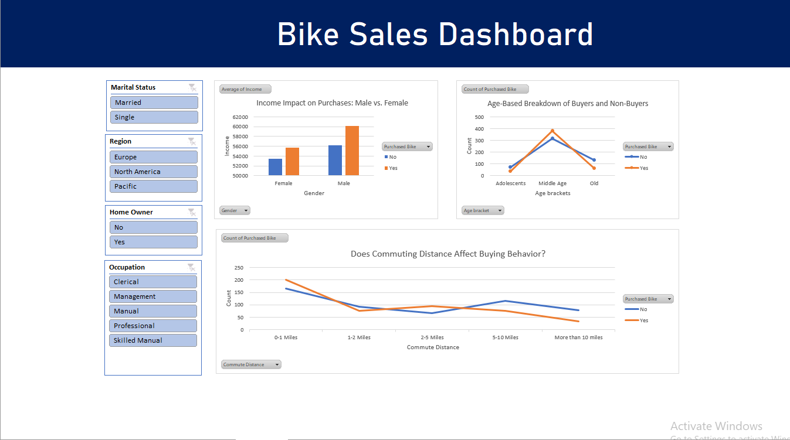

# Bike Buyer Analysis Project  

## Overview  
This project analyzes a dataset of bike buyers to uncover trends and insights. The dataset was cleaned, transformed, and visualized using Excel.  

## Tools Used  
- Microsoft Excel  

## Key Steps  
1. **Data Cleaning**: Removed duplicates and inconsistencies.  
2. **Data Transformation**: Converted "M/F" to "Male/Female" for better readability.  
3. **Analysis**: Used pivot tables to identify trends.  
4. **Visualization**: Created an interactive dashboard with slicers.  

## Key Findings  
- Buyers aged 30-45 accounted for 55% of purchases.  
- 70% of buyers earned between $40k–$80k/year.  
- Europe had the highest sales compared to other regions.  

## Dashboard  
  

## How to Use  
1. Download the Excel file.  
2. Explore the pivot tables and dashboard.  
